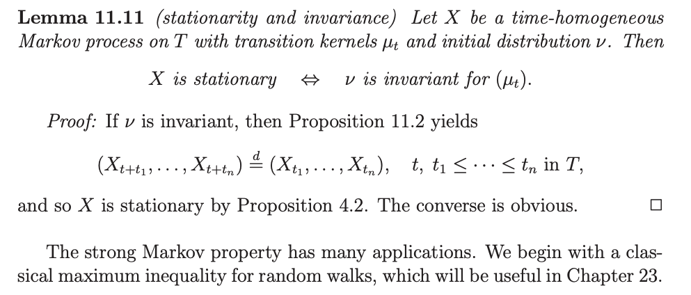

# Invariant measures and reversible kernels

Mathlib source：[Mathlib.Probability.Kernel.Invariance](https://github.com/leanprover-community/mathlib4/blob/7d32461ad224e921eb05ead7ac02156702f4aa59/Mathlib/Probability/Kernel/Invariance.lean)

## 1. Mathemetical results and LEAN translation


- what is the core theorem/definition this file trying to build? (summarize this at the end)

**Theorem 1.** Given a measurable space $(\alpha, \mathcal{A})$, a Markov kernel $\kappa$ from $\alpha$ to itself, and a measure $\pi$ on $\alpha$, suppose that $\kappa$ is reversible with respect to $\pi$. Then $\pi$ is an invariant measure for $\kappa$.

- how is this in LEAN

**Theorem 1 (Lean).** Let $k$ be a Markov kernel (`{κ : Kernel α α} [IsMarkovKernel κ]`) and let $\pi$ be a measure (`{π : Measure α}`). If $k$ is reversible with respect to $\pi$ (`h_rev : IsReversible κ π`), then $\pi$ is invariant under $k$ (`Invariant κ π`).

```lean
theorem IsReversible.invariant
    {κ : Kernel α α} [IsMarkovKernel κ] {π : Measure α}
    (h_rev : IsReversible κ π) : Invariant κ π := by
```
The respected LEAN tactic state is (checked by kernel)
```lean
α     : Type u_1
mα    : MeasurableSpace α
κ     : Kernel α α
inst✝ : IsMarkovKernel κ
π     : Measure α
h_rev : κ.IsReversible π
⊢ κ.Invariant π
```


- what was the proof

**Proof.**
 Write $\pi\kappa$ for the measure defined, for every measurable
$B\subseteq\alpha$, by

$$
(\pi\kappa)(B)=\int_\alpha \kappa(x,B)\,\pi(dx).
$$

To prove that $\pi\kappa=\pi$, fix a measurable set $s\in\mathcal A$ and compare
the two measures on $s$. By the definition of $\pi\kappa$,

$$
(\pi\kappa)(s)=\int_\alpha \kappa(x,s)\,\pi(dx).
$$

In the assumed integral equality, take $A=s$ and $B=\alpha$, and write the result
in the direction needed here:

$$
\int_\alpha \kappa(x,s)\,\pi(dx)
=
\int_s \kappa(x,\alpha)\,\pi(dx).
$$

For every $x\in\alpha$, $\kappa(x,\cdot)$ is a probability measure. Therefore

$$
\kappa(x,\alpha)=1.
$$

It follows that

$$
\int_s \kappa(x,\alpha)\,\pi(dx)
=
\int_s 1\,\pi(dx)
=
\pi(s).
$$

Hence

$$
(\pi\kappa)(s)
=
\int_\alpha \kappa(x,s)\,\pi(dx)
=
\int_s \kappa(x,\alpha)\,\pi(dx)
=
\pi(s).
$$

This holds for every measurable $s$. Thus $\pi\kappa=\pi$, so $\pi$ is invariant
under $\kappa$.


## 2. Core definitions
Definition 1. For every measurable set $B \subseteq \alpha$,
$$
(\mu.\operatorname{bind}\kappa)(B)
=
\int_{\alpha}\kappa(x,B)\,\mu(dx).
$$
```lean
def Invariant (κ : Kernel α α) (μ : Measure α) : Prop :=
  μ.bind κ = μ
```

Remark 1. The original definition of `bind` can be found [here](https://leanprover-community.github.io/mathlib4_docs/Mathlib/MeasureTheory/Measure/GiryMonad.html#MeasureTheory.Measure.bind). In Lean, to prove that two measures are equal, we use measure extensionality, it suffices to check that they assign the same measure to every measurable set. The variable `{mα : MeasurableSpace α}` already specifies which sets are measurable. See the [definition of `MeasurableSpace`](https://github.com/leanprover-community/mathlib4/blob/7f22e856c19eeabc38d75733b71d7e44167307f3/Mathlib/MeasureTheory/MeasurableSpace/Defs.lean#L48-L59).


**Definition 2.** For any measurable sets $A, B \subseteq \alpha$,
$$
\int_A \kappa(x, B)\,\pi(dx)
=
\int_B \kappa(x, A)\,\pi(dx).
$$

```lean
def IsReversible (κ : Kernel α α) (π : Measure α) : Prop :=
  ∀ ⦃A B⦄, MeasurableSet A → MeasurableSet B →
    ∫⁻ x in A, κ x B ∂π = ∫⁻ x in B, κ x A ∂π

```


## 3 Public declaration
- except the core definition and main theorems, what are the other related things we would like to consider?

| Declaration | Role |
|---|---|
| `Kernel.Invariant` | Definition of Invariant|
| `Kernel.IsReversible` | Definition of IsReversible|
| `Kernel.IsReversible.invariant` | Main theorem |
| `Kernel.Invariant.def` | Explicitly show the formula of definition of Invariant |
| `Kernel.Invariant.comp_const` | Expresses invariance as an equality involving a constant kernel. |
| `Kernel.Invariant.comp` | Shows that invariance is preserved under kernel composition. |

Now we focus on discussing the rest three


```lean
theorem Invariant.def (hκ : Invariant κ μ) :
    μ.bind κ = μ :=
  hκ
```
it adds no new mathematical content. The difference of `Kernel.Invariant.def` and `Kernel.Invariant` comes in two folds: (1) when displayed in infoview, a hypothesis `hκ : Invariant κ μ` appears in the InfoView as a named proposition. The theorem `Invariant.def` exposes the same proof with the
explicit type `μ.bind κ = μ`. (2) when using it downstream, `hκ.def` is easier to inspect and can be
used directly by `rw`


To add more realted API, we can directly build some small API such as, the composition of two $\mu$-invariant kernels is again $\mu$-invariant. This push measure invariance to kernel equality.

```lean
nonrec theorem Invariant.comp_const (hκ : Invariant κ μ) : κ ∘ₖ const α μ = const α μ := by
  rw [comp_const κ μ, hκ.def]
```
- explaination: `const α μ` is a **constant kernel**: regardless of the input $x$, it always returns the measure $\mu$, which is
 $$(\operatorname{const}_{\alpha}\mu)(x)=\mu.$$

- what does `nonrec` mean here?
In the imported file in the beginning, `MeasureComp.lean` contains $\kappa \circ_K C_\mu = C_{\mu\kappa}.$

```lean
Kernel.comp_const :
  κ ∘ₖ const α μ = const α (κ ∘ₘ μ)
```
Here we are trying to say, assue invariant, we have $\kappa \circ_K C_\mu = C_\mu.$
```
Invariant.comp_const :
  Invariant κ μ →
  κ ∘ₖ const α μ = const α μ
```
To prove this we need to use the theorem which is also called `Kernel.comp_const`,`nonrec` ensures that the proof refers to the previously defined theorem.

Surely we can just change a name to prevent this `nonrec`! But this design gave us clean API name where we can see the nesetd relationship between the two.
```
ProbabilityTheory.Kernel.comp_const
ProbabilityTheory.Kernel.Invariant.comp_const
```

```lean
theorem Invariant.comp (hκ : Invariant κ μ)(hη : Invariant η μ) :
    Invariant (κ ∘ₖ η) μ
```
proof.
Assume that $\mu\eta=\mu,\mu\kappa=\mu.$, Mathlib’s kernel composition`κ ∘ₖ η` is applied from right to left:

Therefore,

$$
\begin{aligned}
\mu(\kappa\circ\eta)
&=(\mu\eta)\kappa\\
&=\mu\kappa\\
&=\mu.
\end{aligned}
$$
Theses are all the math but the proof body of this theorem consider two cases -  empty α and Nonempty α. However this is actually reduandant for the current mathlib API, I have made a PR to mathlib about this.

## 4. Scope and limitations
To build further, Kallenberg defines invariance for a transition semigroup $(K_t)_{t \geq 0}$ by
  $$
  \mu K_t = \mu
  \qquad \text{for every } t.
  $$

Book `Foundations of Modern Probability` page 242 Lemma 11.11



## Reference
Kallenberg, O., 1997. Foundations of modern probability. New York, NY: Springer New York.
